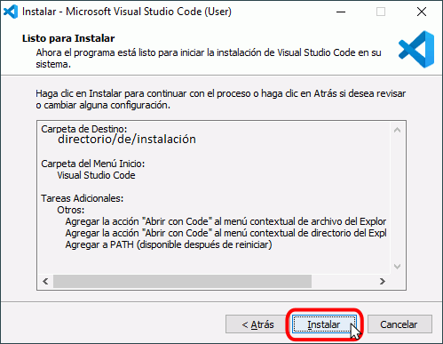
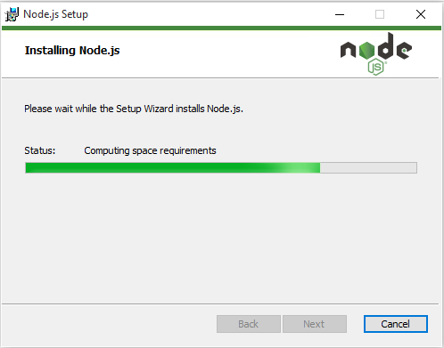
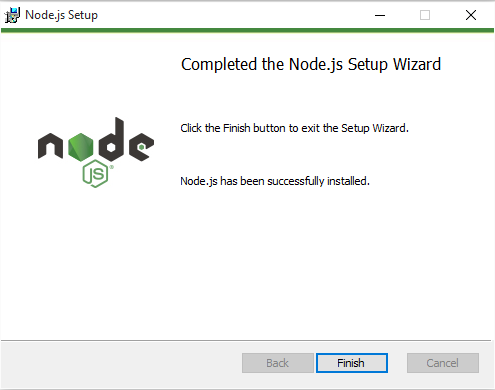

# **Visual Studio Code:** Creación de una Extensión #

----------

## **Descripción** ##
La presenta documentación detalla los pasos para la creación de una extensión para VS Code. La extensión tendrá como funcionalidad insertar una nueva linea cada en función de un intervalo ingresaro por el usuario.

## **Requisitos** ##
- [Visual Studio Code](https://code.visualstudio.com/download)</a>.
- [NodeJS](https://nodejs.org/en/download/current/)
- [Yeoman](https://yeoman.io/)
- [Generator Code]

Además de esto, se necesitará instalar los paquetes <a href="https://yeoman.io/">Yeoman</a> y <a href="https://www.npmjs.com/package/generator-code">Generator-Code</a>.

## **Contenido** ##
- Instalación de requisitos
 - VS Code
 - NodeJS
 - Yeoman y Generator Code
- Generación de código base (Extensión Hola Mundo)
- Codificación y explicación de código
- Depuración
- Ejecución
- Cuestionario
 
## **Instalación de requisitos** ##
##### **Instalación de VS Code** #####
Una vez descardado el instalador, de acuerdo, a la versión y arquitectura elegida (usuario o sistema), se procede a la instalación ejecutando el archivo descardado. En este caso el entorno sobre el que se desarrollará es Windows 10 [64bits].

Al ejecutar el archivo instalador solicitará la aceptación del acuerdo de Licencia (Open Source):

Se establece el directorio de instalación:

Se selecciona la carpeta de instalación para el menu inicio:

Se pueden elegir las opciones para agregar al menú contextual las opciones para abrir el editor en función del directorio o archivo seleccionado:

Al aceptar la última opción se presenta el detalle de la instalación a realizar:

Se extraen e instalan los archivos:

Finalmente da la opción para abrir el editor:

##### **Instalación de NodeJS** #####

De la misma manera que VS Code, se selecciona la versión y arquitectura, en este caso será para Windows.

Al ejecutar el instalador se iniciará el *Wizard* de instalación:

Se presenta el acuerdo de licencia (Open Source):

Se establece el directorio de instalación (*default*):

Se seleccionan los módulos a istalar (*default*):

Se procede con la instalación:

Finalmente muestra el mensaje instalación exitosa:

Para verificar la instalación, en una ventana de Command Prompt, se verifica instalada con el comando:

>``node -v` 

En este caso es la version 12.16.1:

##### **Instalación de Yeoman y Generator Code** #####
Una vez instalado NodeJS el gestor de paquetes de NPM tambien se encontrará en el sistema. Para verificarlo, se puede ejecutar el comando:

>`npm`

Debiendo tener como resultado algo así:

Verificado esto, antes de instalar las utilizades Yeoman y Generator Code, estableceremos el Workspace para la extensión que se desarrollará:

- Se crea un directorio en el que se encontrarán todos los archivos: GapLine (nombre que se le dará a la extensión) y abriremos el editor VS Code a partir de esta carpeta:

	

	O desde una ventana de comandos, ubicados en el directorio, se ejecuta el comando:

	>`code .`

Seguido de esto, se abre una terminal de comandos en VS Code, o en la misma terminal desde la que se ha abierto VS Code, se ejecuta la instalación de las utilidades Yeoman y Generator Code:

>`npm install -g yo generator-code typescript`
	
>- `npm:`  gestor de paquetes
>- install: orden de instalación
>- g: parámetro que indica que la instalación será global
>- yo: Yeoman
>- generator-code: Generator Code, para generar el código esqueleto
>- typescript: Compilador TypeScript a utilizar

Se ejecutará el instalador y una vez finalizado se procederá a generar el código base de la extensión.

## **Generación de código base** ##
Para la generación del código base se ejecutará un comando que también generará una estructura de directorios y archivos para el desarrollo de la extensión:
>`yo code`

En la terminal se mostrará el *wizard* en el que se seleccionará:
>`New Extension (TypeScript)`

El *wizard* solicitará datos necesarios para la generación del código:

Una vez culminado este proceso, se generará la siguiente estructura de directorio:

## **Codificación y explicación de código** ##

Antes de proceder a codificar la funcionalidad de la extensión es necesario que la opción `strict` esté marcada como `true` en el archivo `[tsconfig.json]`.

El archivo sobre el que se codificarán las funciones de la extensión será `[extensions.ts]`, reemplazando el código por el siguiente:

	// Invoca al modo estricto de javascript (ECMAScript 5)
	// para asegurar la ejecucion del código capturando errores
	//dehabilitando funciones confusas, entre otras`

	use strict;

	//importa el modulo vscode que contiene el  API de VS Code
	// referenciandolo con el alias 'vscode'

	import * as vscode from 'vscode';

	// creación del método que activa la extensión
	// cuando se ejecuta el comando asociado a la extensión
	export function activate(context: vscode.ExtensionContext) {
    
    //muestra un mensaje de que la extension se ha activado
    //console.log('Gap Line está activado!');
    vscode.window.showInformationMessage('Gap Line está activado!'); 

    //se declara una variable que contendrá la orden de registro del comando extension.gaplin
    // y que a su vez enviará los parámetros de ejecución del comando: 
    let disposable = vscode.commands.registerCommand(
        
        // comando a registrar
        'extension.gapline', 
        // función lambda
        () => {
        // declara una variable a la que se le asignará
        // el editor de texto que esté abierto (activo) 
        // o que no se haya guardado (undefinied)
        var editor = vscode.window.activeTextEditor;
        
        // si no hay editor de texto no retorna nada
        // se modificó para que muestre un mensaje de error
        if (!editor) { 
            // return;
            // muestra un mensaje de error
            vscode.window.showErrorMessage('No se ha detectado ningún editor'); 
        }

        // declara una variable "selection" a la que se le asignará
        // el texto que esté seleccionado en el editor almacenado en la variable "editor"
        var selection = editor.selection;

        // declara una variable "text" a la que se le asignará
        // el texto seleccionado del documento asociado al editor de texto
        var text = editor.document.getText(selection);
        
        // muestra una caja de texto en la que se le pide al usuario
        // ingresar el intervalo de líneas para la inserción del salto de línea
		vscode.window.showInputBox({ prompt: '¿Cada cuantas líneas desea la inserción?' }).then(value => {
            
            // se crea una variable que almacenará el intervalo ingresado por el usuario
            let numberOfLines = +value;
            
            //crea una variable a la que se le asigna un arreglo string que almacenará el texto
            var textInChunks: Array<string> = [];
            
            // recorre el texto seleccionado y lo divide por salto de linea
            // y por cada linea que recorre
			text.split('\n').forEach((currentLine: string, lineIndex) => {
                
                // agrega el texto dividido al arreglo nuevo textInChunks
                textInChunks.push(currentLine);

                // si la linea actual (indice + 1) corresponde al intervalo ingresado por el usuario
                if ((lineIndex+1) % numberOfLines === 0) {
                    //lo divide agregando un espacio en blanco
                    // despues del salto de línea (\n) para generar una nueva linea
                    textInChunks.push('');
                }
                
            });
            
            // luego de que divide el texto seleccionado 
            // une el arreglo dividido por el separador "\n"
			text = textInChunks.join('\n');
            
            // funcion lambda para editar el documento del editor activo
			editor.edit((editBuilder) => {
                
                // declara una variable de tipo rango
                // que almacenará el rango que recorrerá
                //desde la linea de inicio del texto seleccionado
                //partiendo del carcter 0
                // hasta el final de la línea del texto seleccionado
                //finalizando en el último caracter
                // tomado del tamaño del texto sin los separadores 
                // de la última linea del texto seleccionado
                var range = new vscode.Range(
                    selection.start.line,0,
                    selection.end.line,editor.document.lineAt(selection.end.line).text.length
                );
                
                // utilizar el replace para reemplazar el texto seleccionado 
                // enviando el rango a recorrer 
                // y el texto a reemplazar
				editBuilder.replace(range, text);
            		});
        		})
    		});
    
    		// cierra la ejecución de la extensión
			context.subscriptions.push(disposable);
		}

	// método que se ejecuta cuando la extensión se desactiva
		export function deactivate() { 
		    //muestra un mensaje por consola de que la extension se ha desactivado
		    vscode.window.showInformationMessage('Your extension "gapline" is now inactive!'); 
		}

Otro cambio que habrá que realizar para una correcta ejecución y configuración de la extensión será modificar el archivo package.json en la sección `"contributes"`
	
>`"commands": [
>			{
>				"command": "extension.gapline",
>				"title": "Break it"
>			}
>		]`
>
>- command: define el comando para ejecutar la extensión
>- title: El título de la extensión que aparecerá en la paleta de comandos de VS Code
>

Adicionalmente podemos agregar lo siguiente después de `"contributes"`:

>`"keybindings": [
>			{
>				"command": "extension.gapline",
>				"key": "ctrl+k b"
>			}
>		]`

De esta manera, la extensión será ejecutable a través de los comandos `ctrl+k b`

## **Depuración y Ejecución** ##
Seguido de esto se procede con la depuación del código para ver todo el proceso ejecución y corrección de errores en el caso de que sea necesario. Para eso, se agregan dos breaks en puntos "cruciales" de la ejecución. En este caso, el primero en el momento de recorrer el arreglo, y el segundo en el momento que se integra el arreglo con los saltos de línea. Para el debug, se presiona la tecla `[F5]` o desde el menú `Run->Start Debugging`

Como se puede observar, se puede ejecutar desde la paleta de comandos `[Ctrl+Shift+P]` e ingresando el nombre registrado **`Break it`** o con el atajo de teclado registrado `[Ctrl+K B]`

Una vez ejecutada (activada) la extensión se mostrará un mensaje de que se ha activado la extensión y solicitará

Se pueden agregar variables para observar los cambios que surgen conforme se ejecuta el código, haciendo click derecho sobre la variable deseada y seleccionando `add to Watch`

Finalmente se puede han podido observar los cambios que ha tenido la variable `textInChunks` conforme se ha recorrido el arreglo y se han agregado los espacios en blanco que representarán la inserción de una nueva linea según el intervalo ingresado. Así también se ha reemplazado el texto seleccionado por el texto del arreglo con los saltos de línea.

### **Cuestionario** ###
##### ¿Qué elementos específicos de TypeScript identificas? #####

> El uso del API de VS Code junto con todos sus componentes.
>
> La declaración de arreglos como interface a diferencia de Js que lo hace como una variable *conjunto de datos*.

Autor:   Jasson Pincay